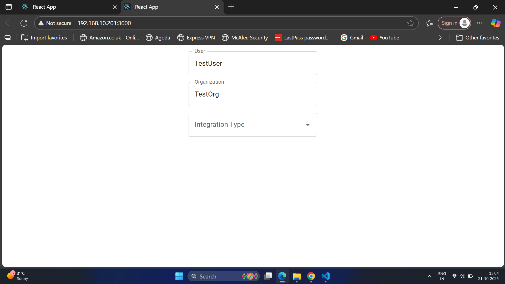
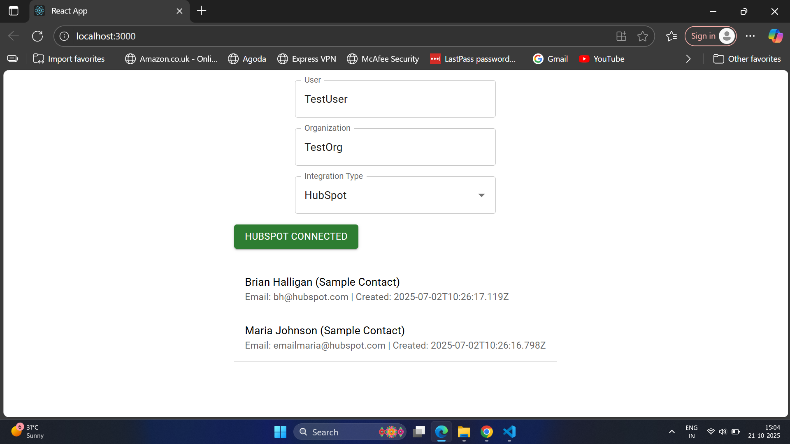

# 🧩 VectorShift Integrations — Technical Assessment

This project implements integrations for multiple platforms such as **HubSpot**, **Airtable**, and **Notion**, with a focus on handling authentication (OAuth 2.0), data retrieval, and secure credential storage using **Redis**.

---

## 🚀 Features

- OAuth 2.0 authentication with HubSpot  
- Token storage and management using Redis  
- API endpoints for fetching integration data  
- Modular backend architecture with FastAPI  
- React frontend for interactive integration management  

---

## 🗂️ Project Structure
```
integrations_technical_assessment/
│
├── frontend/
│ ├── src/
│ │ └── integrations/
│ │ ├── hubspot.js
│ │ ├── airtable.js
│ │ └── notion.js
│ └── package.json
│
└── backend/
├── integrations/
│ ├── hubspot.py
│ ├── airtable.py
│ └── notion.py
├── main.py
├── redis_client.py
├── requirements.txt
└── .env
```

---

## ⚙️ Prerequisites

Before running this project, ensure you have the following installed:

- [Python 3.11.x](https://www.python.org/downloads/)
- [Node.js (LTS)](https://nodejs.org/en/download/)
- [Redis](https://redis.io/download/)
- HubSpot Developer Account → [Create One Here](https://developers.hubspot.com/)

---

## 🔑 HubSpot App Setup

1. Go to [HubSpot Developer Dashboard](https://developers.hubspot.com/).  
2. Create a new **App** → Navigate to **Auth → OAuth 2.0**.  
3. Set the **Redirect URL** to:

http://localhost:8000/integrations/hubspot/oauth2callback


4. Copy the **Client ID** and **Client Secret** — you’ll need these for your `.env` file.

---

## 🧾 Environment Variables

Create a `.env` file inside the **`/backend`** directory:

```bash
HUBSPOT_CLIENT_ID=your_hubspot_client_id
HUBSPOT_CLIENT_SECRET=your_hubspot_client_secret
HUBSPOT_REDIRECT_URI=http://localhost:8000/integrations/hubspot/oauth2callback
REDIS_HOST=127.0.0.1
REDIS_PORT=6379


💡 Replace the placeholder values with your actual HubSpot credentials.
---
🐍 Backend Setup (FastAPI)

Open a terminal inside the backend folder.

Create and activate a virtual environment:

python -m venv venv
venv\Scripts\activate    # Windows
# OR
source venv/bin/activate # macOS/Linux


Install dependencies:
pip install -r requirements.txt
Start Redis (ensure it’s running at 127.0.0.1:6379):
```
bash
redis-server
Run the FastAPI backend:
```
```
bash
uvicorn main:app --reload
Backend runs by default at http://localhost:8000

8000

🖥️ Frontend Setup (React)

Open a new terminal and navigate to the frontend folder:
``
cd frontend
npm install
npm start
```

The React app will run at http://localhost:3000

Make sure the backend (port 8000) and frontend (port 3000) are both running simultaneously.


### 🔄 OAuth 2.0 Flow (HubSpot)

Authorize User

Frontend calls:

GET /integrations/hubspot/authorize?user_id=<USER_ID>&org_id=<ORG_ID>


The backend returns an authorize_url.

User Consent

User logs into HubSpot and grants access.

HubSpot redirects to:

/integrations/hubspot/oauth2callback


Token Exchange

Backend exchanges the code for access and refresh tokens.

Tokens are stored securely in Redis.

Data Fetch

Frontend fetches data:

GET /integrations/hubspot/items?user_id=<USER_ID>&org_id=<ORG_ID>


Backend retrieves data from HubSpot APIs and returns it in a unified format.

🧠 API Endpoints Summary
Endpoint	Method	Description
/integrations/hubspot/authorize	GET	Initiates OAuth flow and returns authorization URL
/integrations/hubspot/oauth2callback	GET	Handles HubSpot redirect and token exchange
/integrations/hubspot/items	GET	Fetches HubSpot items (contacts, deals, etc.)

### screenshots
## 🧩 Integration Dashboard (Frontend)


### 🔐 HubSpot OAuth2 Login

